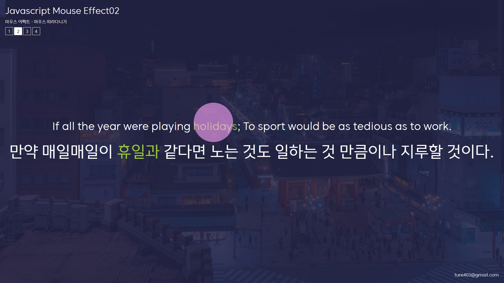

# JS-mouse

자바스크립트로 작성한 마우스 이펙트 입니다. 

******

사용 스택 및 함수(메서드)
---

HTML: 웹 페이지의 구조를 정의하는 데 사용됩니다.  
CSS : 웹 페이지와 애플리케이션의 시각적 디자인과 레이아웃을 제어하여 사용자 경험을 향상시키는 스타일링 언어입니다   
javascript : 
+ window.addEventListener: window 객체에서 발생하는 특정 이벤트를 감지할 수 있도록 해줍니다. 
+ e.clientX: 이벤트 객체에서 마우스 포인터의 X 좌표를 나타내는 속성입니다. 
+ e.clientY: 이벤트 객체에서 마우스 포인터의 Y 좌표를 나타내는 속성입니다. 
+ element.getAttribute():  HTML 요소의 특정 속성(attribute) 값을 가져오는 데 사용됩니다.

# 프로젝트 목적

---

+ addEventListener 이해
+ getAttribute 이해
+ e.client 이해

